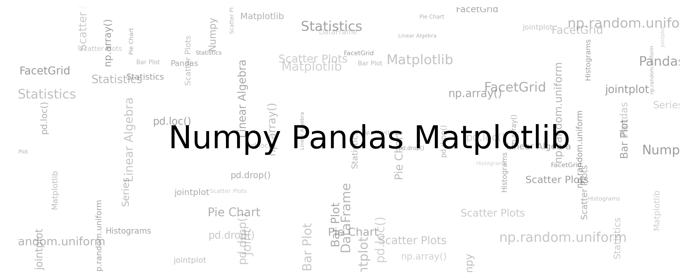

### Tutorial notebooks on numpy, pandas and matplolib

[](https://mybinder.org/v2/gh/v10ndev/Intro-to-Numpy-Pandas-Matplotlib/master) [](https://colab.research.google.com/github/v10ndev/Intro-to-Numpy-Pandas-Matplotlib/blob/master/) [](https://github.com/v10ndev/Intro-to-Numpy-Pandas-Matplotlib/issues) [](https://github.com/v10ndev/Intro-to-Numpy-Pandas-Matplotlib/pulls)
__________



## Introduction
This is the code repository for [Python Data Science Handbook](https://github.com/jakevdp/PythonDataScienceHandbook), published by [jakevdp](http://jakevdp.github.io). It contains all the supporting project files necessary to work through the book from start to finish.

## Instructions and Navigation

* Run online using either [binder](https://mybinder.org/v2/gh/v10ndev/Intro-to-Numpy-Pandas-Matplotlib/master) or [colab](https://colab.research.google.com/github/v10ndev/Intro-to-Numpy-Pandas-Matplotlib/blob/master/).
* To run on your local machine; execute in either CMD or Terminal

```shell
git clone https://github.com/v10ndev/Intro-to-Numpy-Pandas-Matplotlib.git
cd Numpy-Pandas-Matplotlib-Tutorial
```

* Then install the required libraries (requires **python3**)


| Sr. No. | Topic      | Notebook                                                                                                                                                                                                    |
| ------- | ---------- | ----------------------------------------------------------------------------------------------------------------------------------------------------------------------------------------------------------- |
| 1       | Numpy      | [useful syntax.ipynb](https://nbviewer.org/github/v10ndev/Intro-to-Numpy-Pandas-Matplotlib/blob/master/NumPy/00.%20useful%20syntax.ipynb)|
|         | Numpy      | [Creating Arrays from Scratch.ipynb](https://nbviewer.org/github/v10ndev/Intro-to-Numpy-Pandas-Matplotlib/blob/master/NumPy/01.%20Creating%20Arrays%20from%20Scratch.ipynb)|
|         | Numpy      | [The Basics of Numpy Arrays.ipynb](https://nbviewer.org/github/v10ndev/Intro-to-Numpy-Pandas-Matplotlib/blob/master/NumPy/02.%20The%20Basics%20of%20Numpy%20Arrays.ipynb)|
|         | Numpy      | [Computation on Numpy.ipynb](https://nbviewer.org/github/v10ndev/Intro-to-Numpy-Pandas-Matplotlib/blob/master/NumPy/03.%20Computation%20on%20Numpy.ipynb)|
|         | Numpy      | [Aggregations Min, Max, and Everything in Between.ipynb](https://nbviewer.org/github/v10ndev/Intro-to-Numpy-Pandas-Matplotlib/blob/master/NumPy/04.%20Aggregations%20Min%2C%20Max%2C%20and%20Everything%20in%20Between.ipynb)|
|         | Numpy      | [Computation on Arrays.ipynb](https://nbviewer.org/github/v10ndev/Intro-to-Numpy-Pandas-Matplotlib/blob/master/NumPy/05.%20Computation%20on%20Arrays.ipynb)|
|         | Numpy      | [Comparisons, Masks, and Boolean Logic.ipynb](https://nbviewer.org/github/v10ndev/Intro-to-Numpy-Pandas-Matplotlib/blob/master/NumPy/06.%20Comparisons%2C%20Masks%2C%20and%20Boolean%20Logic.ipynb)|
|         | Numpy      | [Fancy Indexing.ipynb](https://nbviewer.org/github/v10ndev/Intro-to-Numpy-Pandas-Matplotlib/blob/master/NumPy/07.%20Fancy%20Indexing.ipynb)|
|         | Numpy      | [Sorting Arrays.ipynb](https://nbviewer.org/github/v10ndev/Intro-to-Numpy-Pandas-Matplotlib/blob/master/NumPy/08.%20Sorting%20Arrays.ipynb)|
|         | Numpy      | [Numpy's Structured Arrays.ipynb](https://nbviewer.org/github/v10ndev/Intro-to-Numpy-Pandas-Matplotlib/blob/master/NumPy/09.%20Numpy%27s%20Structured%20Arrays.ipynb)|
|         |            | 
|         |            |                                                                                                                                                                                                             |
| 2       | Pandas     | [Introducing Pandas Objects.ipynb](https://nbviewer.org/github/v10ndev/Intro-to-Numpy-Pandas-Matplotlib/blob/master/Pandas/01.%20Introducing%20Pandas%20Objects.ipynb)|
|         | Pandas     | [Data Indexing and Selection.ipynb](https://nbviewer.org/github/v10ndev/Intro-to-Numpy-Pandas-Matplotlib/blob/master/Pandas/02.%20Data%20Indexing%20and%20Selection.ipynb)|
|         | Pandas     | [Operating on Data in Pandas.ipynb](https://nbviewer.org/github/v10ndev/Intro-to-Numpy-Pandas-Matplotlib/blob/master/Pandas/03.%20Operating%20on%20Data%20in%20Pandas.ipynb)|
|         | Pandas     | [Handling Missing Data.ipynb](https://nbviewer.org/github/v10ndev/Intro-to-Numpy-Pandas-Matplotlib/blob/master/Pandas/04.%20Handling%20Missing%20Data.ipynb)|
|         | Pandas     | [Hierarchical Indexing.ipynb](https://nbviewer.org/github/v10ndev/Intro-to-Numpy-Pandas-Matplotlib/blob/master/Pandas/05.%20Hierarchical%20Indexing.ipynb)|
|         | Pandas     | [Combining Datasets.ipynb](https://nbviewer.org/github/v10ndev/Intro-to-Numpy-Pandas-Matplotlib/blob/master/Pandas/06.%20Combining%20Datasets.ipynb)|
|         | Pandas     | [Merge and Join.ipynb](https://nbviewer.org/github/v10ndev/Intro-to-Numpy-Pandas-Matplotlib/blob/master/Pandas/07.%20Merge%20and%20Join.ipynb)|
|         | Pandas     | [Aggregation and Grouping.ipynb](https://nbviewer.org/github/v10ndev/Intro-to-Numpy-Pandas-Matplotlib/blob/master/Pandas/08.%20Aggregation%20and%20Grouping.ipynb)|
|         | Pandas     | [Pivot Tables.ipynb](https://nbviewer.org/github/v10ndev/Intro-to-Numpy-Pandas-Matplotlib/blob/master/Pandas/09.%20Pivot%20Tables.ipynb)|
|         | Pandas     | [Vectorized String Operations.ipynb](https://nbviewer.org/github/v10ndev/Intro-to-Numpy-Pandas-Matplotlib/blob/master/Pandas/10.%20Vectorized%20String%20Operations.ipynb)|
|         | Pandas     | [Working with Time Series.ipynb](https://nbviewer.org/github/v10ndev/Intro-to-Numpy-Pandas-Matplotlib/blob/master/Pandas/11.%20Working%20with%20Time%20Series.ipynb)|
|         |            |                                                                                                                                                                                                             |
| 3       | Matplotlib | [General Matplotlib Tips.ipynb](https://nbviewer.org/github/v10ndev/Intro-to-Numpy-Pandas-Matplotlib/blob/master/Visualization%20with%20Matplolib/01.%20General%20Matplotlib%20Tips.ipynb)|
|         | Matplotlib | [Simple Line Plots.ipynb](https://nbviewer.org/github/v10ndev/Intro-to-Numpy-Pandas-Matplotlib/blob/master/Visualization%20with%20Matplolib/02.%20Simple%20Line%20Plots.ipynb)|
|         | Matplotlib | [Simple Scatter Plot.ipynb](https://nbviewer.org/github/v10ndev/Intro-to-Numpy-Pandas-Matplotlib/blob/master/Visualization%20with%20Matplolib/03.%20Simple%20Scatter%20Plot.ipynb)|
|         | Matplotlib | [Visualizing Errors.ipynb](https://nbviewer.org/github/v10ndev/Intro-to-Numpy-Pandas-Matplotlib/blob/master/Visualization%20with%20Matplolib/04.%20Visualizing%20Errors.ipynb)|
|         | Matplotlib | [Density and Contour Plots.ipynb](https://nbviewer.org/github/v10ndev/Intro-to-Numpy-Pandas-Matplotlib/blob/master/Visualization%20with%20Matplolib/05.%20Density%20and%20Contour%20Plots.ipynb)|
|         | Matplotlib | [Histograms, Binning and Density.ipynb](https://nbviewer.org/github/v10ndev/Intro-to-Numpy-Pandas-Matplotlib/blob/master/Visualization%20with%20Matplolib/06.%20Histograms%2C%20Binning%20and%20Density.ipynb)|
|         | Matplotlib | [Customizing Plot Legends.ipynb](https://nbviewer.org/github/v10ndev/Intro-to-Numpy-Pandas-Matplotlib/blob/master/Visualization%20with%20Matplolib/07.%20Customizing%20Plot%20Legends.ipynb)|
|         | Matplotlib | [Customizing Colorbars.ipynb](https://nbviewer.org/github/v10ndev/Intro-to-Numpy-Pandas-Matplotlib/blob/master/Visualization%20with%20Matplolib/08.%20Customizing%20Colorbars.ipynb)|
|         | Matplotlib | [Multiple Subplots.ipynb](https://nbviewer.org/github/v10ndev/Intro-to-Numpy-Pandas-Matplotlib/blob/master/Visualization%20with%20Matplolib/09.%20Multiple%20Subplots.ipynb)|
|         | Matplotlib | [Text and Annotation.ipynb](https://nbviewer.org/github/v10ndev/Intro-to-Numpy-Pandas-Matplotlib/blob/master/Visualization%20with%20Matplolib/10.%20Text%20and%20Annotation.ipynb)|
|         | Matplotlib | [Customizing Ticks.ipynb](https://nbviewer.org/github/v10ndev/Intro-to-Numpy-Pandas-Matplotlib/blob/master/Visualization%20with%20Matplolib/11.%20Customizing%20Ticks.ipynb)|
|         | Matplotlib | [Three-Dimensional Plotting in Matplotlib.ipynb](https://nbviewer.org/github/v10ndev/Intro-to-Numpy-Pandas-Matplotlib/blob/master/Visualization%20with%20Matplolib/12.%20Three-Dimensional%20Plotting%20in%20Matplotlib.ipynb)|
|         | Matplotlib | [Visualization with Seaborn.ipynb](https://nbviewer.org/github/v10ndev/Intro-to-Numpy-Pandas-Matplotlib/blob/master/Visualization%20with%20Matplolib/13.%20Visualization%20with%20Seaborn.ipynb)|
